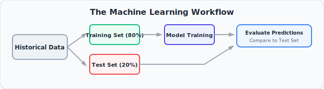
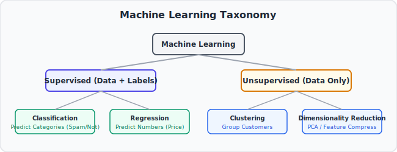
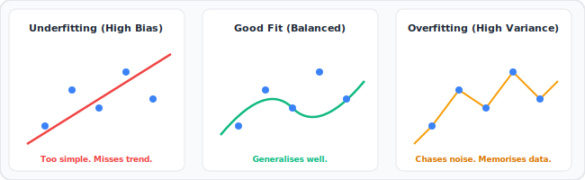

# 📊 StatQuest #01: A Gentle Introduction to Machine Learning

> **Video:** [A Gentle Introduction to Machine Learning](https://www.youtube.com/watch?v=Gv9_4yMHFhI)
> **Series:** StatQuest Machine Learning Playlist
> **Core Idea:** Machine Learning is about teaching computers to learn patterns from data — so they can make predictions on data they've never seen before.

---

## 🎯 The Core Intuition (Plain English First)

Imagine you want to predict if someone will like a movie. You could write a long list of rules: "If it has explosions AND it stars Tom Hanks, then yes." But writing rules for every possible case is impossible — there are too many combinations.

Instead, **Machine Learning** takes a different approach: give the computer thousands of examples of movies people liked and didn't like, and let it **figure out the rules itself** from the data.

That's the big idea. Instead of programming rules, you program a system that **learns rules from examples**.

---

## 📌 Where This Fits in the Big Picture

This is the **entry point** to the entire playlist. Before diving into any specific algorithm, you need to understand:

- What machine learning actually is (and isn't)
- The two main types of problems ML solves
- The vocabulary everyone uses

Everything else in this playlist builds on these foundations.

---

## 🧩 Step-by-Step Conceptual Walkthrough

### Step 1: What Does "Learning" Mean for a Computer?

Learning = finding patterns in historical data and using those patterns to make predictions on new data.

A machine learning model:

1. **Sees** many examples (training data)
2. **Discovers** patterns (trains a model)
3. **Applies** those patterns to new situations (makes predictions)

### Step 2: The Two Main Types of Machine Learning Problems

#### Supervised Learning

You have data AND labels (the correct answers).

Examples:

- Predicting house prices (input: features of house, label: sale price)
- Email spam detection (input: email text, label: spam/not spam)
- Disease diagnosis (input: patient data, label: has disease / doesn't)

The model learns to map inputs → labels.

#### Unsupervised Learning

You have data but NO labels. You want to discover hidden structure.

Examples:

- Grouping customers by behaviour (K-Means clustering)
- Reducing many features to a few (PCA)
- Finding unusual activity (anomaly detection)

### Step 3: The Two Main Types of Supervised Learning

#### Classification

The label is a **category** — one of a fixed set of options.

- "Is this email spam? Yes or No."
- "What digit is this? 0–9."
- "Does this patient have cancer? Yes or No."

#### Regression

The label is a **number** on a continuous scale.

- "What is this house worth? $247,000."
- "How many units will we sell next month? 1,432."
- "What will the temperature be tomorrow? 23°C."

### Step 4: Training Data vs. Test Data

The most important rule in machine learning:

**You must test your model on data it has NEVER seen during training.**

- **Training data:** What the model learns from.
- **Test data:** What you use to evaluate how well the model learned. Keep it completely separate.

If you test on training data, you're just checking if the model memorised the answers — not if it actually learned the patterns.

### Step 5: The Goal — Generalisation

A good model doesn't just memorise the training examples. It extracts the **underlying pattern** that will apply to new, unseen examples.

- A model that works on training data but fails on new data = **overfitting** (memorised, didn't learn)
- A model that doesn't even fit the training data well = **underfitting** (too simple to capture the pattern)

The goal is a model that **generalises** — performs well on new data it's never seen.

---

## 💡 Key BAM Moments

- BAM! Machine learning doesn't mean the computer is "thinking." It's finding mathematical patterns in numbers. That's it.
- BAM! The quality of your **data** matters more than the algorithm you choose. Garbage in = garbage out.
- BAM! You can't judge a model's quality by its performance on training data alone. Always evaluate on held-out test data.
- BAM! "Fitting" a model = adjusting its internal parameters until its predictions match the training labels as closely as possible.

---

## 🗂️ Key Vocabulary Introduced

| Term               | Plain English Meaning                                            |
| :----------------- | :--------------------------------------------------------------- |
| **Training Data**  | Examples the model learns from                                   |
| **Test Data**      | Examples used to evaluate the model — never seen during training |
| **Features**       | The input variables (X) — what we know about each example        |
| **Label / Target** | The output variable (Y) — what we want to predict                |
| **Model**          | The mathematical function learned from data                      |
| **Classification** | Predicting a category                                            |
| **Regression**     | Predicting a number                                              |
| **Overfitting**    | Model memorised training data but fails on new data              |
| **Underfitting**   | Model is too simple to capture the pattern                       |
| **Generalisation** | Model performs well on new, unseen data                          |

---

## ❓ Active Recall Questions

1. What is the difference between supervised and unsupervised learning?
2. What is the difference between classification and regression?
3. Why must you never evaluate a model on its training data?
4. What is overfitting? What is underfitting?
5. What does it mean for a model to "generalise"?

---

## 🔗 Related Notes (Next in Playlist)

- [[StatQuest 02 — Cross Validation]]
- [[StatQuest 03 — The Confusion Matrix]]
- [[StatQuest 06 — Bias and Variance]]

---

_Tags: #statquest #machine-learning #introduction #supervised-learning #unsupervised-learning #classification #regression #overfitting #underfitting #generalisation_
