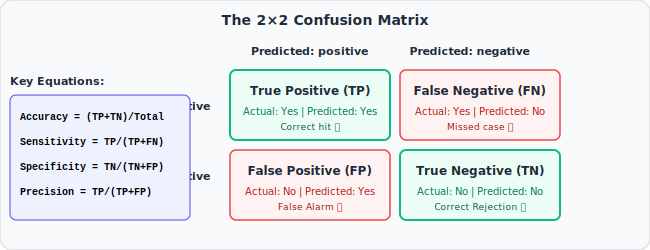
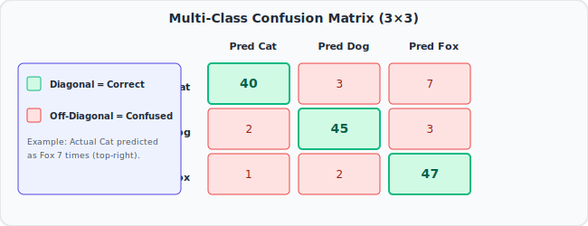

# 📊 StatQuest #03: Machine Learning Fundamentals — The Confusion Matrix

> **Video:** [Machine Learning Fundamentals: The Confusion Matrix](https://www.youtube.com/watch?v=Kdsp6soqA7o)
> **Series:** StatQuest Machine Learning Playlist
> **Core Idea:** Accuracy alone doesn't tell the full story. The Confusion Matrix breaks down exactly what kinds of mistakes your model is making.

---

## 🎯 The Core Intuition (Plain English First)

Suppose a hospital has a test for a rare disease. The disease affects only 1 in 1000 people. A completely useless test that always says "No disease" would be **99.9% accurate** — but it would miss every single sick patient.

Accuracy alone is a terrible metric here. You need to know:

- Out of all the sick patients, how many did you correctly identify? (Did you catch the disease?)
- Out of all the healthy patients, how many did you wrongly flag? (Did you cause false alarms?)

The **Confusion Matrix** answers these questions by showing you **exactly what happened to each type of outcome**.

---

## 📌 Where This Fits in the Big Picture

The Confusion Matrix is introduced right after Cross Validation because it's the **foundation of almost all classification metrics**. Accuracy, Sensitivity, Specificity, Precision, Recall, F1-score — all of them are calculated from the four numbers in the confusion matrix. You can't understand any of those metrics without understanding this first.

---

## 🧩 Step-by-Step Conceptual Walkthrough

### Step 1: The Four Possible Outcomes

In binary classification (Positive vs. Negative), every prediction falls into one of four buckets:

|                       | **Predicted Positive** | **Predicted Negative** |
| :-------------------- | :--------------------: | :--------------------: |
| **Actually Positive** |   True Positive (TP)   |  False Negative (FN)   |
| **Actually Negative** |  False Positive (FP)   |   True Negative (TN)   |

Let's use a medical example. Disease = Positive, No Disease = Negative.

- **True Positive (TP):** Patient HAS the disease. Test says YES. ✅ Correct.
- **True Negative (TN):** Patient does NOT have disease. Test says NO. ✅ Correct.
- **False Positive (FP):** Patient does NOT have disease. Test says YES. ❌ Wrong — a false alarm.
- **False Negative (FN):** Patient HAS the disease. Test says NO. ❌ Wrong — missed the disease.

### Step 2: Building the Matrix

After running your classifier on test data, count how many predictions fell into each category. Arrange in a 2×2 grid:

### Step 3: Reading the Matrix

From this example:

- We correctly identified 90 out of 100 sick patients (TP = 90, FN = 10)
- We correctly cleared 985 out of 1000 healthy patients (TN = 985, FP = 15)
- We missed 10 sick patients (FN = 10) — dangerous in medical settings
- We falsely alarmed 15 healthy patients (FP = 15)

### Step 4: Accuracy — And Why It's Not Enough

$$\text{Accuracy} = \frac{TP + TN}{TP + FP + FN + TN} = \frac{90 + 985}{1100} = 97.7\%$$

This sounds great! But we missed 10% of sick patients. Whether that's acceptable depends on the use case.

For a deadly disease, missing 10% of sick patients is catastrophic. For spam email, missing 10% of spam is annoying but acceptable.

**Accuracy hides the details. The confusion matrix shows them.**

### Step 5: The Multi-Class Extension

For problems with more than 2 classes (e.g., Cat, Dog, Fox), the confusion matrix becomes N×N:

- Diagonal = correct predictions
- Off-diagonal = mistakes (what did it confuse X for?)

The matrix immediately shows you which classes the model confuses with which other classes.

---

## 📐 The Math (After the Intuition)

$$\text{Accuracy} = \frac{TP + TN}{TP + FP + FN + TN}$$

**Total Error Rate:**

$$\text{Error Rate} = 1 - \text{Accuracy} = \frac{FP + FN}{TP + FP + FN + TN}$$

---

## 💡 Key BAM Moments

- BAM! The "confusion" in Confusion Matrix refers to how the model **confuses** one class for another — the off-diagonal cells.
- BAM! For **imbalanced datasets** (one class is much rarer), accuracy can be very high while the model completely fails on the rare class. Always look at the confusion matrix.
- BAM! Rows = actual classes. Columns = predicted classes. (Or vice versa depending on convention — always check which orientation your tool uses.)
- BAM! The sum of each row = total actual cases of that class. The sum of each column = total predicted cases of that class.

---

## ❓ Active Recall Questions

1. What do the four cells of a confusion matrix represent?
2. Why is accuracy sometimes a misleading metric for classification problems?
3. In a disease detection scenario, which is worse: a False Positive or a False Negative? Does it depend on the disease?
4. How do you extend the confusion matrix to more than 2 classes?
5. If all predictions land on the main diagonal of the confusion matrix, what does that mean?

---

## 🔗 Related Notes

- [[StatQuest 02 — Cross Validation]]
- [[StatQuest 04 — Sensitivity and Specificity]]
- [[StatQuest 07 — ROC and AUC]]
- [[ML — Classification Performance Metrics Part 1]]
- [[ML — Performance Metrics Multi-Class Classification]]

---

_Tags: #statquest #machine-learning #confusion-matrix #true-positive #false-positive #true-negative #false-negative #accuracy #classification-metrics_
