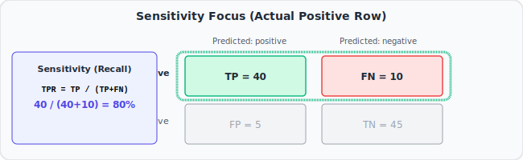
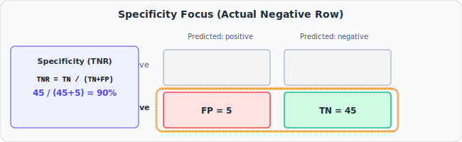

# 📊 StatQuest #04: Machine Learning Fundamentals — Sensitivity and Specificity

> **Video:** [Machine Learning Fundamentals: Sensitivity and Specificity](https://www.youtube.com/watch?v=vP06aMoz4v8)
> **Series:** StatQuest Machine Learning Playlist
> **Core Idea:** Two metrics that together give you the full picture of how a classifier performs — one for catching the positives, one for clearing the negatives.

---

## 🎯 The Core Intuition (Plain English First)

Going back to the hospital example from Note #03:

You have a disease test. Two questions matter most:

**Question 1:** "Of all the people who actually HAVE the disease, what fraction did the test correctly detect?"
→ This is **Sensitivity** (also called Recall or True Positive Rate)
→ Are we good at catching sick people?

**Question 2:** "Of all the people who actually DON'T have the disease, what fraction did the test correctly clear?"
→ This is **Specificity** (also called True Negative Rate)
→ Are we good at not alarming healthy people?

These two metrics together tell you everything about how your classifier performs on both classes.

---

## 📌 Where This Fits in the Big Picture

Sensitivity and Specificity are the **two core building blocks** of more advanced metrics. Specifically:

- **Sensitivity = True Positive Rate** → used to build the ROC curve (Y-axis in Note #7)
- **1 − Specificity = False Positive Rate** → also used in the ROC curve (X-axis in Note #7)

Understanding these two numbers deeply makes the ROC curve completely intuitive.

---

## 🧩 Step-by-Step Conceptual Walkthrough

### Step 1: Setting Up the Example

Say we test 100 patients:

- 50 actually have the disease
- 50 are actually healthy

Our test results:

- Of the 50 sick patients: 40 were correctly detected (TP = 40), 10 were missed (FN = 10)
- Of the 50 healthy patients: 45 were correctly cleared (TN = 45), 5 were falsely alarmed (FP = 5)

Confusion matrix:

```
               Predicted: Sick   Predicted: Healthy
Actual: Sick  [   TP = 40    |     FN = 10       ]
Actual: Healthy [  FP = 5    |     TN = 45       ]
```

### Step 2: Sensitivity — How Good Are We at Catching Sick People?

**Look at just the sick row (Actual: Sick):**



- 40 correctly detected (TP)
- 10 missed (FN)
- Total sick = 50

$$\text{Sensitivity} = \frac{TP}{TP + FN} = \frac{40}{40 + 10} = \frac{40}{50} = 0.80 = 80\%$$

**Plain English:** We correctly detected 80% of all sick patients. We missed 20%.

High Sensitivity = few sick people slipped through undetected.

### Step 3: Specificity — How Good Are We at Clearing Healthy People?

**Look at just the healthy row (Actual: Healthy):**



- 45 correctly cleared (TN)
- 5 falsely alarmed (FP)
- Total healthy = 50

$$\text{Specificity} = \frac{TN}{TN + FP} = \frac{45}{45 + 5} = \frac{45}{50} = 0.90 = 90\%$$

**Plain English:** We correctly cleared 90% of all healthy patients. We falsely alarmed 10%.

High Specificity = few healthy people were wrongly flagged.

### Step 4: The Trade-Off Between Sensitivity and Specificity

Here's the key insight: **you can't maximise both at the same time** with a fixed model.


If you lower your decision threshold (flag more people as sick):

- Sensitivity goes UP (catch more sick people)
- Specificity goes DOWN (more false alarms for healthy people)

If you raise your decision threshold (flag fewer people as sick):

- Sensitivity goes DOWN (miss more sick people)
- Specificity goes UP (fewer false alarms)

This trade-off is the foundation of the ROC curve.

### Step 5: Which Matters More?

**It depends entirely on the situation:**

- **Cancer screening:** You'd rather have high Sensitivity. Missing a cancer (FN) is deadly. False alarms (FP) cause stress but are caught in follow-up.
- **Spam filter:** You'd rather have high Specificity. Putting a real email in spam (FP) is bad. Letting some spam through (FN) is annoying but tolerable.

There's no universally correct answer — the right balance depends on the real-world cost of each type of mistake.

---

## 📐 The Math (After the Intuition)

$$\text{Sensitivity (Recall, TPR)} = \frac{TP}{TP + FN}$$

$$\text{Specificity (TNR)} = \frac{TN}{TN + FP}$$

$$\text{False Positive Rate (FPR)} = 1 - \text{Specificity} = \frac{FP}{FP + TN}$$

**The ROC curve plots TPR (Sensitivity) on the Y-axis vs. FPR (1 − Specificity) on the X-axis.**

---

## 💡 Key BAM Moments

- BAM! Sensitivity and Specificity are calculated from **different rows** of the confusion matrix. Sensitivity looks at the "Actual Positive" row. Specificity looks at the "Actual Negative" row.
- BAM! **High Sensitivity + Low Specificity** = catches almost all sick people, but triggers many false alarms.
- BAM! **Low Sensitivity + High Specificity** = few false alarms, but misses many sick people.
- BAM! **Sensitivity = Recall = True Positive Rate.** These three names mean exactly the same thing. Different fields use different names — medicine says "Sensitivity", ML says "Recall", statistics says "True Positive Rate."

---

## ❓ Active Recall Questions

1. What does Sensitivity measure? Write the formula.
2. What does Specificity measure? Write the formula.
3. What is the relationship between Specificity and False Positive Rate?
4. If you lower the decision threshold for a classifier, what happens to Sensitivity and Specificity?
5. Give an example where high Sensitivity matters more than high Specificity. Then give one where the opposite is true.

---

## 🔗 Related Notes

- [[StatQuest 03 — The Confusion Matrix]]
- [[StatQuest 05 — Sensitivity Specificity Precision Recall Sing-a-Long]]
- [[StatQuest 07 — ROC and AUC]]
- [[ML — Classification Performance Metrics Part 1]]
- [[ML — ROC and AUC Curve Intuition]]

---

_Tags: #statquest #machine-learning #sensitivity #specificity #true-positive-rate #false-positive-rate #recall #confusion-matrix #classification-metrics #trade-off_
