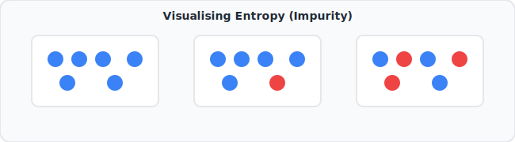
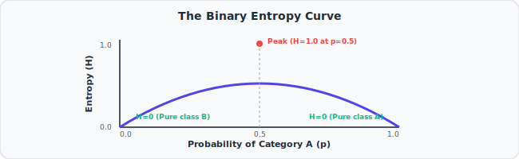

# 7. Entropy (for data science) Clearly Explained!!!
🔗 https://www.youtube.com/watch?v=YtebGVx-Fxw

## The Big Idea
Entropy is a number that measures **how mixed up / impure / surprising** a set of categories is. Low entropy = mostly one category (predictable). High entropy = an even mix of categories (unpredictable). This number becomes the key ingredient for building Decision Trees later.

## Flow of the Video

### 1. Setting up the example
- Simple example: a bag of "dog treats" or a party guest list with 3 kinds of dogs — Chihuahuas, Pugs, and mixed breeds (a mix of categories in a container). We want a number that describes how "mixed" the group is.

### 2. Two extreme scenarios first (intuition before formula)
- **Scenario 1 — all one type**: if every dog at the party is a Chihuahua, there's total predictability — pick a random dog and you know exactly what it is. This should give **entropy = 0** (no surprise, no impurity).
- **Scenario 2 — perfectly even mix**: if the party has an equal split of Chihuahuas, Pugs, and mixed breeds, picking a random dog is maximally unpredictable — this gives the **highest possible entropy**.



### 3. The formula
```
Entropy = -Σ [ p(i) * log2( p(i) ) ]
```
- For each category `i`, take its probability `p(i)` (fraction of the group it makes up), multiply by log base 2 of that probability, sum across all categories, then flip the sign (because log of a fraction is negative, so we negate to get a positive entropy value).



### 4. Working through a simple example
- Say a party has 8 dogs: 4 Chihuahuas, 4 Pugs (no mixed breeds, just to keep numbers simple).
  - p(Chihuahua) = 4/8 = 0.5, p(Pug) = 4/8 = 0.5
  - Entropy = -(0.5 × log2(0.5) + 0.5 × log2(0.5))
  - log2(0.5) = -1
  - Entropy = -(0.5×(-1) + 0.5×(-1)) = -(-0.5 - 0.5) = 1
  - **Entropy = 1** (this is actually the maximum possible entropy for 2 categories — a perfect 50/50 split).
- If instead it was 7 Chihuahuas and 1 Pug (mostly one type, more "pure"):
  - p(Chihuahua)=7/8=0.875, p(Pug)=1/8=0.125
  - Entropy = -(0.875×log2(0.875) + 0.125×log2(0.125)) ≈ -(0.875×(-0.19) + 0.125×(-3)) ≈ 0.54
  - Lower entropy (0.54 < 1) because the group is more "pure"/predictable.

### 5. Why entropy matters for data science
- When building a **Decision Tree**, at every split we want to choose the question that makes the resulting groups as "pure" as possible (low entropy) — i.e., splits that separate categories cleanly rather than leaving a jumbled mix.
- Entropy gives us a precise number to compare "how good" different possible splits are.

## Key Takeaways (Quick Recall)
- Entropy measures impurity/unpredictability of a mixed group of categories.
- Formula: Entropy = -Σ p(i) log2(p(i))
- Entropy = 0 → totally pure group (all one category).
- Entropy is maximized when categories are perfectly evenly split.
- Used in Decision Trees to decide which question best separates the data.
