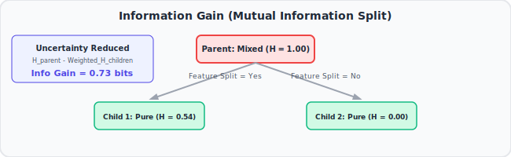

# 8. Mutual Information, Clearly Explained!!!
🔗 https://www.youtube.com/watch?v=eJIp_mgVLwE

## The Big Idea
Mutual Information measures **how much knowing one variable tells you about another variable**. If two variables are totally unrelated, Mutual Information = 0. If they're tightly linked, Mutual Information is large.


## Flow of the Video

### 1. Setting up the example
- Simple example: imagine two coin-like variables — whether someone **exercises** (Yes/No) and whether they **have heart disease** (Yes/No). We want to know: does knowing exercise habits tell us anything about heart disease?

### 2. Start with entropy of each variable alone
- Compute the entropy of "Has Heart Disease" by itself (ignoring exercise) — this tells us the baseline unpredictability of heart disease status in the population.
- This uses the exact same entropy formula from the previous video.

### 3. Now condition on the other variable
- Split the population into "Exercisers" and "Non-exercisers."
- Compute the entropy of "Has Heart Disease" **within each group separately**.
- If exercise really matters, these within-group entropies should be **lower** than the overall entropy (each group becomes more "pure"/predictable about heart disease once you know their exercise status).

### 4. The formula (Mutual Information = reduction in entropy)
```
Mutual Information = Entropy(Disease) - Weighted Average of Entropy(Disease | Exercise Group)
```
- In words: take the overall uncertainty about heart disease, then subtract the *leftover* uncertainty once you already know someone's exercise status (weighted by how many people are in each exercise group).
- The amount of uncertainty that "disappears" once you know exercise status = Mutual Information.



### 5. Interpreting the number
- **Mutual Information = 0**: knowing exercise status tells you nothing new about heart disease (they're statistically independent).
- **Mutual Information > 0**: knowing exercise status reduces your uncertainty about heart disease — the two variables share information.
- The bigger the number, the stronger the relationship.

### 6. Why this matters
- Mutual Information is a more general relationship-detector than correlation — it can catch relationships that aren't just straight-line (linear) relationships, because it's built directly from probabilities, not from assuming a linear pattern.
- It's directly used in building **Decision Trees**: at each split, we can pick whichever feature gives the **highest Mutual Information** with the outcome we're trying to predict (this is mathematically the same idea as "information gain").

## Key Takeaways (Quick Recall)
- Mutual Information = how much one variable tells you about another, measured via entropy reduction.
- Formula: MI = Entropy(overall) − weighted average of Entropy(within each subgroup).
- MI = 0 means independent variables; larger MI means stronger relationship.
- This is the same math used for "information gain" when building Decision Trees.
