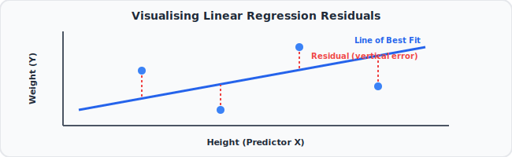
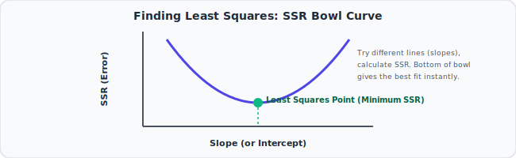

# 9. The Main Ideas of Fitting a Line to Data (Least Squares & Linear Regression)
🔗 https://www.youtube.com/watch?v=PaFPbb66DxQ

## The Big Idea
To "fit a line" to data, we need a way to measure how good or bad a line is, and then a method to find the *best* possible line by that measure. The standard approach: minimize the **sum of squared residuals**.

## Flow of the Video

### 1. Setting up the example
- Simple example: plot of people's **height** (x-axis) vs. **weight** (y-axis). We want a straight line that predicts weight from height.

### 2. What makes a line "good" or "bad"?
- For any candidate line, look at each data point's **residual** = the vertical distance between the actual data point and the line's prediction at that x-value.
- A "good" line has small residuals overall; a "bad" line has large residuals.



### 3. Why square the residuals instead of just adding them up?
- If you just add up residuals directly, positive and negative residuals (points above vs. below the line) **cancel out**, which would make an obviously bad line look artificially "good" (sum = 0).
- Squaring each residual makes everything positive, so they can't cancel out, and it also **punishes big misses more heavily** than small ones.

### 4. The Sum of Squared Residuals (SSR)
```
SSR = Σ (actual value - predicted value)²
```
- This single number summarizes how bad a specific line is: smaller SSR = better fit.

### 5. Finding the best line: try many candidates, keep the best
- Imagine rotating/shifting a candidate line slightly, recomputing SSR each time.
- Plot **SSR vs. the line's slope/intercept** — this creates a bowl-shaped curve.
- The bottom of the bowl = the settings (slope & intercept) that give the **smallest possible SSR** — this is the "best fit" line.


- (Behind the scenes, calculus — taking a derivative and setting it to zero — is what actually finds the bottom of the bowl instantly, rather than trying every line by brute force. StatQuest keeps this conceptual here and dives into the math in the next video.)

### 6. This is the essence of "Least Squares"
- The whole method is called **Least Squares** because we are finding the line that produces the *least* sum of squares (SSR).
- Linear Regression = fitting a straight line using this least-squares principle.

## Key Takeaways (Quick Recall)
- Residual = actual value − predicted value (vertical distance from data point to the line).
- We square residuals so they don't cancel out and to penalize big errors more.
- SSR (Sum of Squared Residuals) = a single score for how good/bad a line is.
- The best-fit line = whichever slope/intercept combination minimizes SSR.
- This whole approach is called "Least Squares" — the foundation of Linear Regression.
