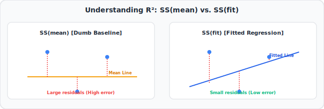

# 10. Linear Regression, Clearly Explained!!!
🔗 https://www.youtube.com/watch?v=7ArmBVF2dCs

## The Big Idea
Beyond just fitting the best line (previous video), we need ways to answer: "How much better is this line than just guessing the average?" and "Is this relationship even statistically real, or could it be random noise?" That's **R²** and the **p-value**.

## Flow of the Video

### 1. Recap: fitting the least-squares line
- Same idea as before: find the line that minimizes the Sum of Squared Residuals (SSR) around the line.

### 2. The baseline: just using the average
- Before fitting any line, imagine your "dumbest" possible prediction: just always guess the **mean (average)** of y, ignoring x entirely.
- Compute the sum of squared residuals around this simple average line — call it **SS(mean)**.

### 3. Comparing the fitted line to the baseline: R²
**Formula:**
```
R² = ( SS(mean) - SS(fit) ) / SS(mean)
```



- SS(mean) = total squared error using just the average.
- SS(fit) = total squared error using our fitted regression line.
- R² tells us: **what fraction of the variation in y is explained by x** (via our line), compared to just guessing the mean.
- Simple example: if SS(mean) = 100 and SS(fit) = 20, then R² = (100-20)/100 = 0.8 → the line explains 80% of the variation in the data; the remaining 20% is unexplained (noise, or other factors).
- R² ranges from 0 (line is no better than the average) to 1 (line perfectly predicts every point).

### 4. Is R² statistically significant? Enter the p-value
- A high R² could still happen by pure chance, especially with small datasets.
- We use an **F-statistic** built from R² (or equivalently SS values) and the number of data points/parameters, then look up how extreme that F-value is compared to what we'd expect from pure random data with no real relationship.
- This gives us the **p-value**: the probability of seeing an R² this large (or larger) purely by chance if there were actually no relationship between x and y.
- Small p-value (typically < 0.05) → we're confident the relationship is real, not just noise.

### 5. Putting it together
- Simple example: fitting weight vs. height might give R² = 0.8 (line explains 80% of variation) with p-value = 0.001 (very unlikely to be random chance) → strong, statistically significant relationship.
- If R² were tiny (like 0.02) and p-value large (like 0.6), the line barely helps and isn't statistically convincing.

## Key Takeaways (Quick Recall)
- R² = (SS(mean) − SS(fit)) / SS(mean) → fraction of variation explained by the line, compared to just guessing the average.
- R² ranges 0 to 1; higher = better fit relative to the naive mean-guess.
- The p-value tells us whether that R² is likely to be "real" or could easily happen by random chance.
- Together, R² tells you "how much" the relationship matters, and the p-value tells you "how sure" you can be it's real.
