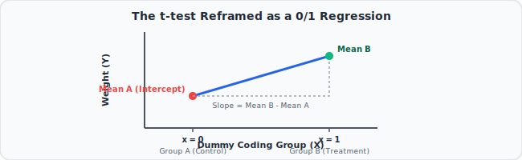
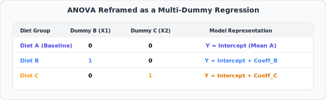

# 12. Using Linear Models for t-tests and ANOVA, Clearly Explained!!!
🔗 https://www.youtube.com/watch?v=NF5_btOaCig

## The Big Idea
A t-test and an ANOVA — which are usually taught as separate, special "statistical tests" — can both be recreated exactly using ordinary least-squares regression, just by cleverly coding categorical groups as 0s and 1s (dummy variables). This unifies everything you've learned about regression with classic hypothesis testing.

## Flow of the Video

### 1. Reframing the t-test as a regression problem
- Classic t-test example: compare average weight between **Group A** (control) and **Group B** (treatment) — are the means different?
- Instead of the classic formula, build a regression where:
  - x = 0 if the person is in Group A, x = 1 if in Group B (a simple on/off switch).
  - y = weight.
- Fit a least-squares line to this data.

### 2. Interpreting the fitted line
- Because x only takes values 0 or 1, the "line" really just connects the **average of Group A** (at x=0) to the **average of Group B** (at x=1).
- The line's **intercept** = mean of Group A.
- The line's **slope** = the difference between Group B's mean and Group A's mean.
- Testing whether that slope is significantly different from 0 (using the regression's p-value) is **mathematically identical** to running a classic two-sample t-test.

### 3. Extending to ANOVA (more than 2 groups)
- Simple example: comparing average weight across **three** diets (A, B, C) — this is normally handled with ANOVA (Analysis of Variance).
- Trick: use **two dummy variables** to represent three groups:
  - Dummy 1 = 1 if Diet B, else 0.
  - Dummy 2 = 1 if Diet C, else 0.
  - Diet A is the "baseline" (both dummies = 0).
- Fit a regression with both dummy variables as predictors.
- The intercept = mean of Diet A (the baseline group).
- Each dummy's coefficient = the difference between that diet's mean and Diet A's mean.
- Testing whether **all these coefficients together** are significantly different from 0 (using an F-test, same as in Multiple Regression) is mathematically the same as running an ANOVA.

### 4. Why this matters
- t-tests and ANOVA aren't some totally separate universe of statistics — they are **special cases of linear regression** with categorical (0/1 coded) predictors.
- This means everything you already know about regression (R², p-values, residuals, F-tests) directly applies to comparing group means too.

## Key Takeaways (Quick Recall)
- Coding groups as 0/1 dummy variables turns "compare group means" into a regression problem.
- 2 groups + 1 dummy variable = regression equivalent of a t-test.
- 3+ groups + multiple dummy variables (one group = baseline) = regression equivalent of ANOVA.
- The intercept = baseline group's mean; each slope = difference from baseline.
- t-tests and ANOVA are just special, simplified versions of the general linear model.
