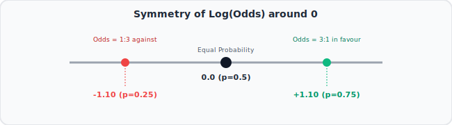
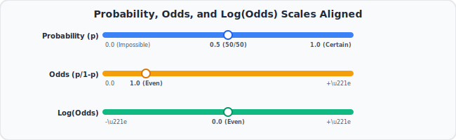

# 14. Odds and Log(Odds), Clearly Explained!!!
🔗 https://www.youtube.com/watch?v=ARfXDSkQf1Y

## The Big Idea
"Odds" are a different (but related) way of expressing a probability, and "log(odds)" is a further transformation that makes odds symmetric and easier to model mathematically — this is exactly the quantity that Logistic Regression predicts internally.

## Flow of the Video

### 1. Probability vs. Odds
- **Probability** of an event = (favorable outcomes) / (all possible outcomes). Ranges from 0 to 1.
- **Odds** of an event = (probability event happens) / (probability event does NOT happen) = p / (1-p).
- Simple example: if a team wins 3 out of 4 games, probability of winning = 3/4 = 0.75.
  - Odds of winning = 0.75 / (1 - 0.75) = 0.75 / 0.25 = **3** (often phrased "3 to 1 odds" of winning).

### 2. Odds are not symmetric around "even" — that's a problem
- If odds of winning = 3, odds of losing = 1/3 ≈ 0.33.
- Notice: "3 to 1 in favor" and "3 to 1 against" don't look symmetric as raw numbers (3 vs. 0.33), even though they represent mirror-image situations. This asymmetry makes odds awkward to use directly in models.

### 3. The fix: take the log of the odds
```
log(odds) = log( p / (1-p) )
```
- Simple example continued: log(3) ≈ 1.10, and log(0.33) ≈ -1.10.
- Now winning and losing odds are perfectly symmetric (same size, opposite sign) around **0**, which represents 50/50 odds (log(1) = 0).
- This symmetry is exactly why statisticians prefer working with log(odds) instead of raw odds or raw probabilities when building models.



### 4. Visualizing probability vs. log(odds)
- Probability is squeezed between 0 and 1.
- Log(odds) stretches that same information across the full range from **negative infinity to positive infinity** — this stretching makes it possible to model log(odds) using an ordinary straight line (like in regression), something that raw probability (being bounded 0 to 1) can't do easily.



### 5. Why this matters for what's coming next
- **Logistic Regression** (a few videos ahead) fits a straight line to **log(odds)**, not to raw probability — that's the entire trick behind how logistic regression works, and everything from here builds toward that idea.

## Key Takeaways (Quick Recall)
- Odds = p / (1-p): a ratio comparing "event happens" vs. "event doesn't happen."
- Odds ≠ probability — they're related but scaled differently, and are asymmetric around 50/50.
- log(odds) fixes the asymmetry: symmetric around 0, and stretches to the full number line (-∞ to +∞).
- This log(odds) scale is exactly what Logistic Regression models with a straight line internally.
