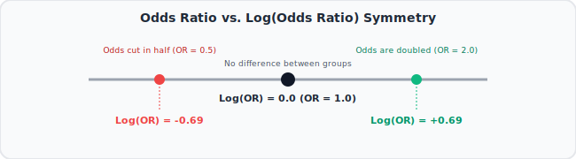

# 15. Odds Ratios and Log(Odds Ratios), Clearly Explained!!!
🔗 https://www.youtube.com/watch?v=8nm0G-1uJzA

## The Big Idea
While "odds" describe a single group, an "Odds Ratio" **compares the odds between two groups** — this comparison is exactly what the coefficients in Logistic Regression represent.

## Flow of the Video

### 1. Recap: odds for a single group
- Odds = p / (1-p), from the previous video.
- Simple example: among people who **exercise**, odds of having heart disease = 1/4 (i.e., for every 1 person with disease, 4 don't).
- Among people who **don't exercise**, odds of having heart disease = 1/2 (for every 1 person with disease, 2 don't).

### 2. Comparing the two groups: Odds Ratio
```
Odds Ratio = Odds(Group 1) / Odds(Group 2)
```
- Continuing the example: Odds Ratio = Odds(no exercise) / Odds(exercise) = (1/2) / (1/4) = **2**.
- Interpretation: the odds of having heart disease are **2 times higher** for non-exercisers compared to exercisers.


### 3. What an Odds Ratio of 1 means
- If Odds Ratio = 1, the two groups have identical odds — the variable (exercise, in this case) makes no difference.
- Odds Ratio > 1: first group has higher odds. Odds Ratio < 1: first group has lower odds.

### 4. Same asymmetry problem as before
- Just like raw odds, Odds Ratios are **not symmetric**: an Odds Ratio of 2 (double the odds) and an Odds Ratio of 0.5 (half the odds) represent equally strong but opposite effects, yet they don't look symmetric as raw numbers (2 vs. 0.5).

### 5. The fix: Log(Odds Ratio)
```
log(Odds Ratio) = log( Odds(Group 1) / Odds(Group 2) )
```
- Simple example: log(2) ≈ 0.69, and if we'd flipped the comparison, log(0.5) ≈ -0.69 — perfectly symmetric around 0, exactly like log(odds) was symmetric before.
- **log(Odds Ratio) = 0** means no difference between groups (Odds Ratio = 1).
- Positive log(Odds Ratio) = first group has higher odds; negative = lower odds.



### 6. Why this matters
- This is precisely what a **coefficient in Logistic Regression** represents: each coefficient is a **log(Odds Ratio)** comparing how the odds of the outcome change as a predictor changes (e.g., going from "non-exerciser" to "exerciser").
- Understanding this makes logistic regression's coefficients interpretable instead of mysterious.

## Key Takeaways (Quick Recall)
- Odds Ratio = Odds(Group 1) / Odds(Group 2) — compares odds across two groups.
- Odds Ratio = 1 → no difference; >1 → higher odds in group 1; <1 → lower odds in group 1.
- log(Odds Ratio) fixes the asymmetry issue, just like log(odds) did for plain odds — symmetric around 0.
- Logistic Regression coefficients are literally log(Odds Ratios) — this is the bridge to the next several videos.
