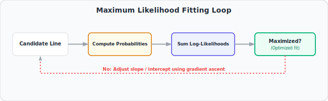

# 18. Logistic Regression Details Pt 2: Maximum Likelihood
🔗 https://www.youtube.com/watch?v=BfKanl1aSG0

## The Big Idea
Since Logistic Regression can't use "minimize squared residuals" (its outcomes are 0/1, not continuous), it instead finds the best-fitting curve using **Maximum Likelihood**: pick the curve that makes the data we actually observed as probable as possible.

## Flow of the Video

### 1. Start with a candidate line in log(odds) space
- Just like before, imagine we're fitting `log(odds) = intercept + slope × x` (e.g., x = weight, outcome = obese Yes/No).
- Pick *some* candidate line to start (any slope/intercept).

### 2. Project each data point onto the candidate line
- For each person's x-value (weight), plug it into the candidate line to get their **predicted log(odds)**.
- Convert that predicted log(odds) into a **predicted probability** using the sigmoid formula: `p = e^(log odds) / (1 + e^(log odds))`.

### 3. Compute the "likelihood" of the actual observed outcome
- For each person who **actually is obese** (true value = 1), their contribution to the likelihood is their **predicted probability of being obese**.
- For each person who **actually is not obese** (true value = 0), their contribution is **1 minus** their predicted probability (i.e., predicted probability of NOT being obese).
- Multiply all these individual contributions together across every person → this product is the overall **Likelihood** of the data given this particular candidate line.

### 4. Why we use log-likelihood instead of raw likelihood
- Multiplying many small probabilities together produces an extremely tiny number (computationally awkward).
- Instead, we take the **log** of each probability and **add them up** (since log turns multiplication into addition) — giving the **log-likelihood**, which is mathematically equivalent for comparison purposes but far more practical to compute.

### 5. Try different candidate lines, keep the one with the highest log-likelihood
- Just like Least Squares tried different lines to *minimize* SSR, Logistic Regression tries different lines to **maximize** the log-likelihood.
- In practice, this search isn't brute-force guessing — it uses iterative optimization methods (like gradient ascent) that climb toward the maximum efficiently.
- The final chosen line (in log-odds space) — and its corresponding S-curve (in probability space) — is the official **fitted Logistic Regression model**.

## Key Takeaways (Quick Recall)
- Logistic Regression can't minimize squared residuals like linear regression — it maximizes **likelihood** instead.
- For each data point, its "contribution" to the likelihood is the model's predicted probability of that point's *actual* observed outcome.
- Multiply all contributions together (or add their logs) to get the (log-)likelihood of the whole dataset for a given candidate line.
- The best-fit logistic curve = whichever line maximizes this log-likelihood, found via iterative optimization (not a simple formula like least squares).
